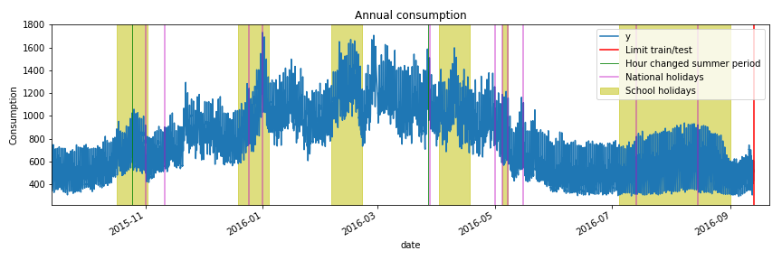

# Solution of the Data Challenge of the 2018 JDS

This repository details the winning solution established by our team LPSM204 for the [data challenge](https://www.sfds.asso.fr/fr/jeunes_statisticiens/manifestations/610-data_challenge_jds_2018/) organized prior the [2018 JDS conference](http://jds2018.sfds.asso.fr/) by the [Young Statisticians and Probabilists](https://www.sfds.asso.fr/fr/jeunes_statisticiens/468-les_jeunes_statisticiens/) group.

## Authors

The LPSM204 team is composed of three PhD Student from [Sorbonne University, LPSM](https://www.lpsm.paris/):

- Nazih Benoumechiara,
- Nicolas Meyer,
- Taïeb Touati,

 and sharing the same office (204).

## Abstract 

Short-term forecasting is a major issue for the main french electricity utility ["Electricité de France" (EDF)](https://www.edf.fr/). The purpose of forecasting is to predict future scenario and to adapt supply to demand. Energy producers mainly consider electrical consumption history to predict future demand. Another important information is the weather, which can greatly influence the consumption. The challenge proposed here is about forecasting the electricity consumption of a small island based on a one year history of electricity consumption and weather condition.

The method established is based on two approaches :

- a time-series forecasting using the electricity consumption, 
- a machine learning approach using the electricity consumption and the weather conditions.

The final result is a smart mix between the prediction of both approaches.

The notebook of the solution is available [here](https://github.com/NazBen/solution-challenge-jds18/blob/master/notebook/solution_LPSM204.ipynb).

## Dependencies

Specific python packages are necessary if you're willing to test proposed methodology. In addition to the very casual ones (e.g., scipy, pandas, seaborn and others), you'll need:

- statsmodels (for the ARMA modeling),
- lightgbm (for Gradient Boosting trees),
- hyperopt (for hyperparameter tuning),
- holidays (for calendar holidays),

All can be easily installed from Anaconda or pip.

## External data

- French calendar of school holidays available [here](http://telechargement.index-education.com/vacances.xml).

## Oral Presentation

A talk will be held Tuesday 29 of May at the [2018 JDS conference](http://jds2018.sfds.asso.fr/) to shortly present our solution. The schedule is available [here](https://toltex.u-ga.fr/programmeJDS2018) and the slides are available [here](https://github.com/NazBen/solution-challenge-jds18/blob/master/slides_challenge_jds_2018.pdf).

## Technical report

Following this competition, a paper should be submitted at the [CSBIGS (Case Studies in Business, Industry and Government Statistics)](https://www.sfds.asso.fr/fr/publications/627-transfert_csbigs/) journal in collaboration with the 2nd winning team.

## Acknowledgment

Our thanks go to the organizer of the challenge and surely to our respective PhD supervisors who let us take some time to work on the challenge.
